# Homewor05 - Stability of Legendre Polynomials
For this homework I here report the answers to the various points in order to include all the information regarding the questions at this [link](https://codimd.infn.it/s/J2RN0fKY5).

## 1: Project Structure

The `src/` directory contains the C source files used for the numerical experiment. In particular, `compute.c` drives the generation of the error table, while `legendre_polynomials.c` implements the forward recurrence, the backward recurrence, and the reference evaluation used for the comparison.

The `include/` directory stores the public headers `legendre_polynomials.h` and `spherical_harm.h`. These files expose the function prototypes shared by the source files and keeps the interface separated from the implementation.

The `scripts/` directory contains the Python post-processing utilities. At the moment it includes `plot_errors.py`, which reads the generated CSV file and produces the plots of absolute and relative errors for the selected values of $x$ both for legendre polynomials and spherical harmonics.

The `outputs/` directory is used for generated results. It collects the CSV table with the computed errors together with the image files produced by the plotting script, so numerical data and visualizations remain separate from the source code.

Finally, the `Makefile` coordinates the full workflow: compilation of the C code, execution of the program, creation of the Python virtual environment, and generation of the plots.

To reproduce the workflow from the `HomeWork05/` directory:

```bash
# Compile the C program
make

# Run the executable and generate outputs/legendre_errors.csv
make run

# Create the local virtual environment for plotting dependencies
make venv

# Run the full pipeline: execute C code and generate all plots
make plot-python
```

Optional cleanup commands:

```bash
# Remove build artifacts and binaries
make clean

# Remove build artifacts, binaries, generated outputs, and virtual environment
make clean-all

# Remove the Python virtual environment
make clean-venv
```

## 2 & 3: Plots of the absolute and relative errors for foreward and backward recurrence
I give here the pots for the absulute and relative errors values of the foreward and backward recurrence versus the high-precision reference for values of $x \in \{0.1,0.5,0.9,0.99\}$.

<figure>
	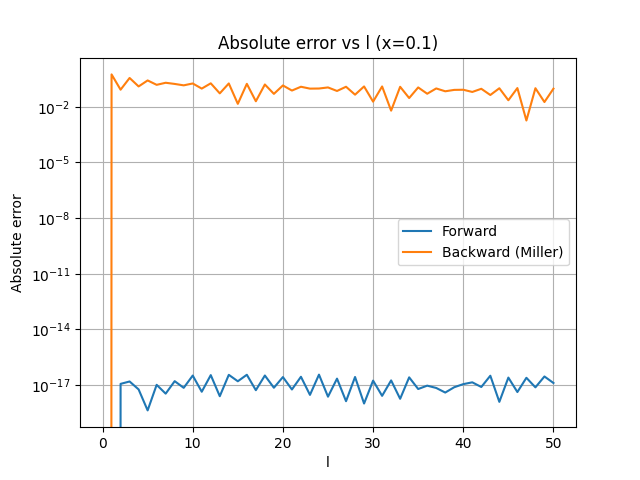
	<figcaption>Figure 1. Absolute errors for the forward and backward recurrence at x = 0.1.</figcaption>
</figure>

<figure>
	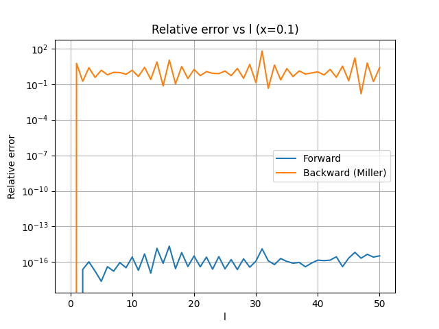
	<figcaption>Figure 2. Relative errors for the forward and backward recurrence at x = 0.1.</figcaption>
</figure>

<figure>
	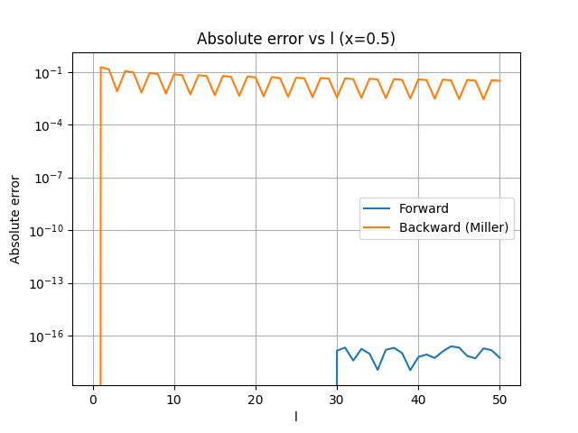
	<figcaption>Figure 3. Absolute errors for the forward and backward recurrence at x = 0.5.</figcaption>
</figure>

<figure>
	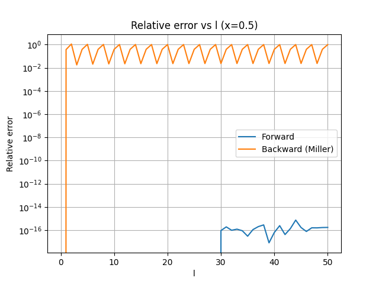
	<figcaption>Figure 4. Relative errors for the forward and backward recurrence at x = 0.5.</figcaption>
</figure>

<figure>
	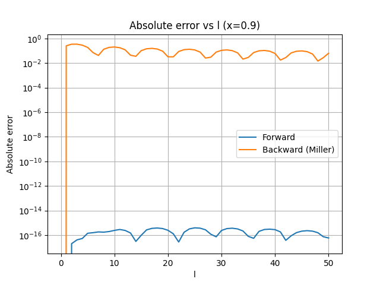
	<figcaption>Figure 5. Absolute errors for the forward and backward recurrence at x = 0.9.</figcaption>
</figure>

<figure>
	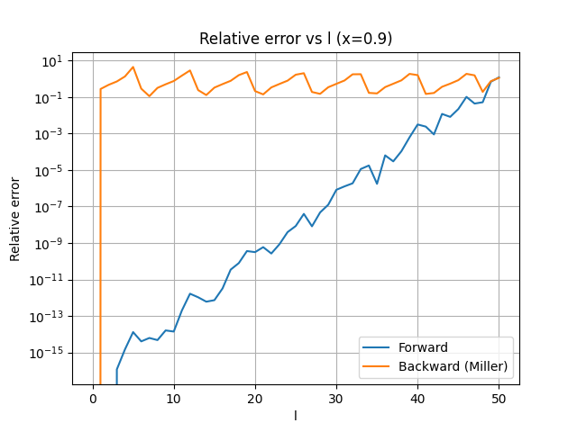
	<figcaption>Figure 6. Relative errors for the forward and backward recurrence at x = 0.9.</figcaption>
</figure>

<figure>
	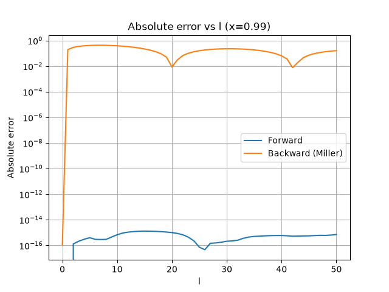
	<figcaption>Figure 7. Absolute errors for the forward and backward recurrence at x = 0.99.</figcaption>
</figure>

<figure>
	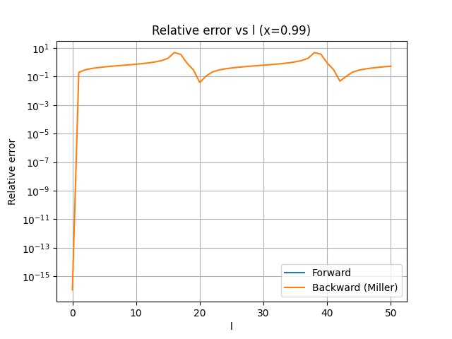
	<figcaption>Figure 8. Relative errors for the forward and backward recurrence at x = 0.99.</figcaption>
</figure>

From the plots above it is clear how the foreward recurrence is more numerically stabel. Indeed the absolute and relative errors with respect to the high precision reference is clearly lower for the foreward recurrence than for the backward recurrence.

__NOTE:__ the high precision reference only works on cloudveneto. When trying to run the code I get numerical instability also for the foreward recursion. This is probably because the `long double` is not actually double precision on my laptop (Mac with M3 chip).

## 4: Explanation of the Numerical Behaviour

The recurrence
$$P_{\ell+1}(x)=\frac{2\ell+1}{\ell+1}xP_\ell(x)-\frac{\ell}{\ell+1}P_{\ell-1}(x)$$
is second order, so it has **two independent solutions**. The physical sequence $P_\ell(x)$ is selected only when two conditions are enforced (for example $P_0=1$ and $P_1=x$).

Miller's algorithm is effective when, in the backward direction, the wanted solution is the minimal one and the unwanted mode is strongly damped. In that case, starting from arbitrary values at large $L$ and normalizing at the end suppresses the wrong component.

In this experiment (ordinary Legendre $P_\ell(x)$ for $|x|<1$), that clean dominant/minimal separation is not observed in a way that automatically selects $P_\ell$. The backward run uses arbitrary seeds ($\tilde P_{L+1}=0$, $\tilde P_L=1$) and only one final normalization ($P_0=1$), so it does not enforce the second physical condition $P_1=x$. As a consequence, the computed backward sequence remains contaminated by the second independent solution.

This is exactly what the data show in `outputs/legendre_errors.csv`:

- Forward recurrence stays near machine precision for all tested $x$ up to $\ell=50$.
	- At $\ell=50$: relative error is about $3.40\times10^{-16}$ ($x=0.1$), $1.73\times10^{-16}$ ($x=0.5$), $3.42\times10^{-16}$ ($x=0.9$), $2.37\times10^{-15}$ ($x=0.99$).
- Backward recurrence is much less accurate with the arbitrary initialization.
	- At $\ell=50$: relative error is about $2.46$ ($x=0.1$), $1.00$ ($x=0.5$), $3.69\times10^{-1}$ ($x=0.9$), $5.35\times10^{-1}$ ($x=0.99$).
	- Maximum backward relative errors in the table are also large (up to about $6.16\times10^{1}$ for $x=0.1$).

Therefore, for the requested setup, the expected behavior is confirmed: **forward recurrence is stable and accurate**, while the **arbitrary backward recurrence generally does not recover the physical $P_\ell$ sequence**.

## 5: Spherical Harmonics

For spherical harmonics I observe the following relative errors:

<figure>
	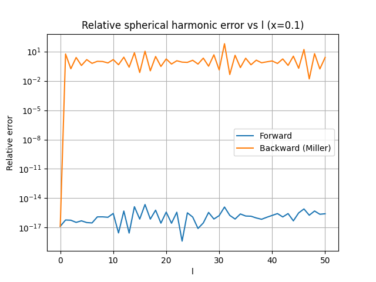
	<figcaption>Figure 9. Relative errors for the spherical harmonics computed from the forward and backward recurrence at x = 0.1.</figcaption>
</figure>

<figure>
	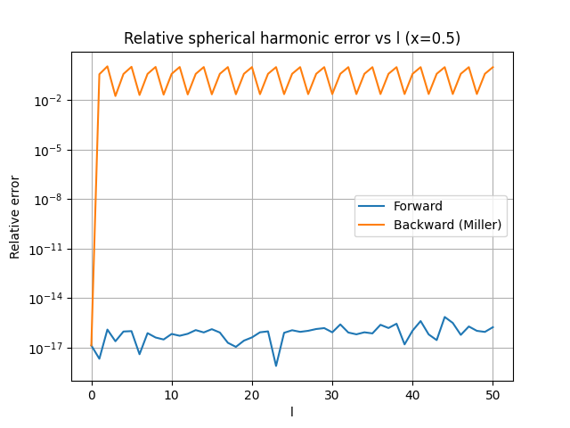
	<figcaption>Figure 10. Relative errors for the spherical harmonics computed from the forward and backward recurrence at x = 0.5.</figcaption>
</figure>

<figure>
	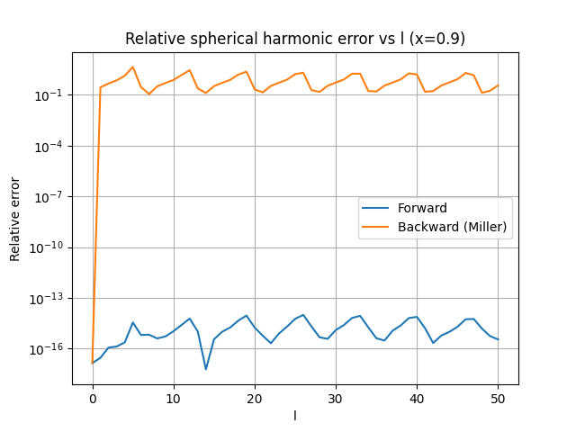
	<figcaption>Figure 11. Relative errors for the spherical harmonics computed from the forward and backward recurrence at x = 0.9.</figcaption>
</figure>


<figure>
	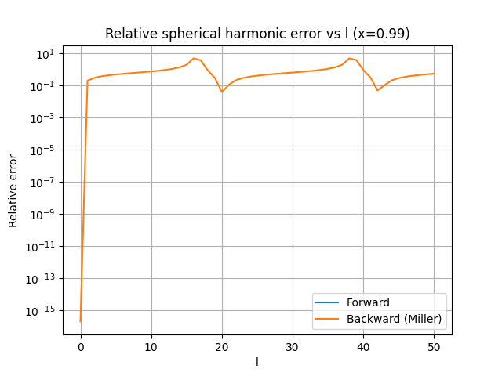
	<figcaption>Figure 12. Relative errors for the spherical harmonics computed from the forward and backward recurrence at x = 0.99.</figcaption>
</figure>

Since
$$Y_{\ell 0}(\theta,\phi)=\sqrt{\frac{2\ell+1}{4\pi}}\,P_\ell(\cos\theta),$$
the normalization factor is known and does not introduce additional instability. Therefore, the relative error in $Y_{\ell0}$ should track the relative error in $P_\ell(\cos\theta)$.

This is exactly what the data show: in `outputs/legendre_errors.csv`, the columns `rel_err_sph_forward` and `rel_err_forward` (and analogously `rel_err_sph_back` and `rel_err_back`) are equal up to machine-roundoff differences (maximum absolute mismatch about $2\times10^{-16}$ for forward and $9\times10^{-16}$ for backward). So the spherical-harmonic error behavior is a direct propagation of the Legendre error behavior.