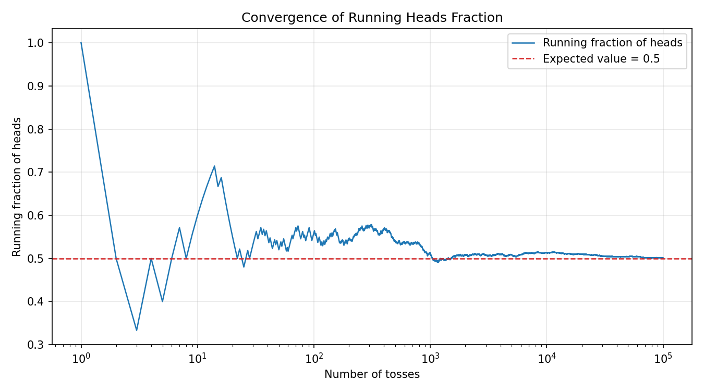
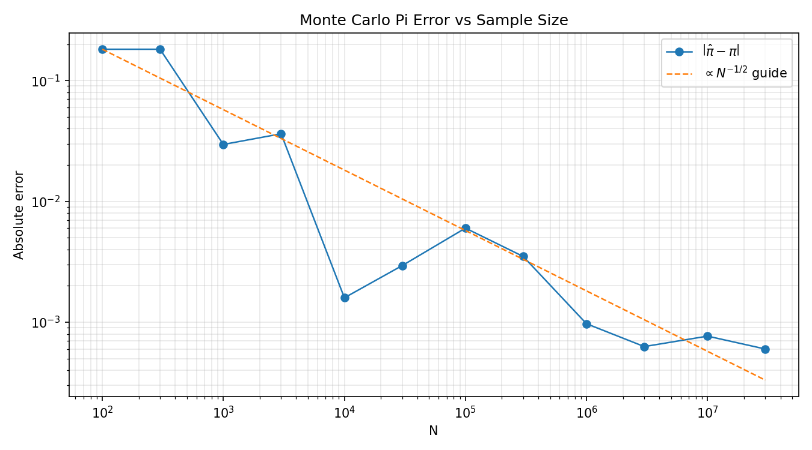
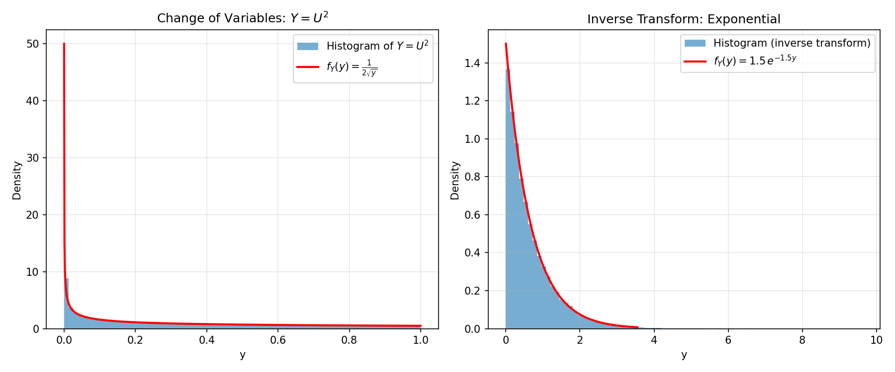
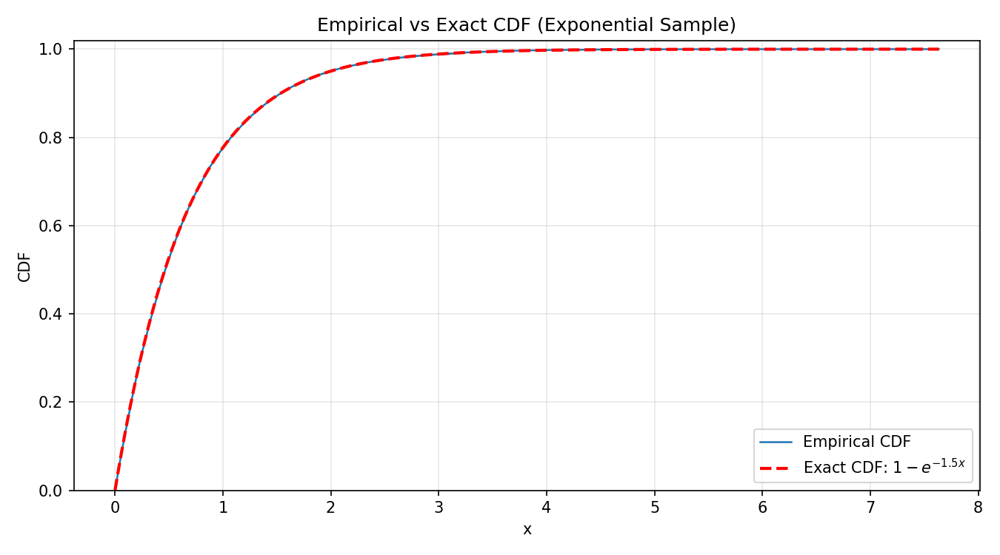

# HomeWork 07
In this MarkDown file I will write the answers to the HomeWork07.
All the appointed tasks are implemented in the file `random_number_generation.c`. The plots are done with the script `plots.py`

To run everything from this folder, use the Makefile commands below. `make plot-python` compiles and runs the C program, creates a local Python virtual environment (if needed), installs plotting dependencies, and generates all figures.

```bash
make all
make run
make venv
make plot-python
```

## 1: Coin Tosses and Low of Large Numbers (LLN)


<figure>
    
    <figcaption>Figure 1. Fraction of heads as the number of tosses increase.</figcaption>
</figure>

As one can clearly see from Figure 1, as the number of tosses increases the fraction of heads converges to the value of $0.5$ for the Low of Large Numbers.

## 2: Monte Carlo estimate for $\pi$
<figure>
    
    <figcaption>Figure 2. The absolute error of the estimation for pi and the reference value of pi as the size of the sample increases plotted against the value of 1 over the sqare root of the sample size expected with Monte Carlo.</figcaption>
</figure>

As one cen see from Figure 2, the absolute error $|\hat{\pi}  -\pi|$ decreases with the sample size $N$. It follows the expected behaviour of $\frac{1}{\sqrt{N}}$ for Monte Carlo.

## 3 & 4: Change of variables: $Y=U^2$
<figure>
    
    <figcaption>Figure 3. Left: histogram of samples generated by the change of variables $Y=U^2$ with $U\sim\mathrm{Uniform}(0,1)$, compared with the analytic density $f_Y(y)=\frac{1}{2\sqrt{y}}$. Right: histogram of samples generated by inverse transform sampling for an exponential law (rate $\lambda=1.5$), compared with $f_Y(y)=\lambda e^{-\lambda y}$.</figcaption>
</figure>

For the change-of-variables test, I generate $U\sim\mathrm{Uniform}(0,1)$ and set $Y=U^2$. The theoretical CDF is
$$
F_Y(y)=P(Y\le y)=P(U^2\le y)=P(U\le \sqrt{y})=\sqrt{y},\qquad 0\le y\le 1,
$$
therefore the density is
$$
f_Y(y)=\frac{d}{dy}F_Y(y)=\frac{1}{2\sqrt{y}}.
$$
In the left panel of Figure 3, the histogram follows this analytic curve well, including the higher density near $y=0$.

In the right panel I also show inverse transform sampling for an exponential distribution with rate $\lambda=1.5$. Using
$$
Y=-\frac{1}{\lambda}\ln(1-U),
$$
the sampled histogram matches the target density $f_Y(y)=\lambda e^{-\lambda y}$, confirming that the inverse-transform method is correctly implemented.

## 5: Empirical CDF

<figure>
    
    <figcaption>Figure 4. Empirical CDF (step plot) of 50000 exponential samples with rate $\lambda=1.5$, compared with the exact CDF $F(x)=1-e^{-\lambda x}$ (dashed red line).</figcaption>
</figure>

To build the empirical CDF I generate $n=50000$ samples from an exponential distribution with rate $\lambda=1.5$ via inverse transform sampling:
$$
Y = -\frac{1}{\lambda}\ln(1-U), \qquad U\sim\mathrm{Uniform}(0,1).
$$
The sorted samples $x_{(1)}\le x_{(2)}\le\cdots\le x_{(n)}$ define the empirical CDF
$$
\hat{F}_n(x) = \frac{1}{n}\sum_{i=1}^{n}\mathbf{1}[x_{(i)}\le x],
$$
plotted as a step function. By the Glivenko–Cantelli theorem, $\hat{F}_n$ converges uniformly to the true CDF $F(x)=1-e^{-\lambda x}$ as $n\to\infty$. As Figure 4 shows, the empirical step function closely tracks the dashed exact curve across the full support, with deviations visible only in the far tail where samples are sparse.

